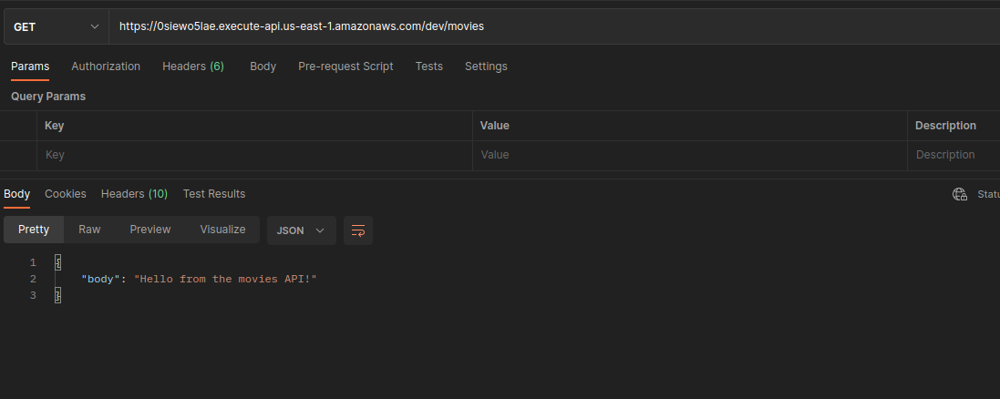

# Example of API Rest on AWS 

Amazon API Gateway is a fully managed serverless offering from AWS that makes it easy for developers to develop and maintain API


1. Initial Setup
You should also have an AWS IAM user configured with the necessary  IAM permissions to access API Gateway and Lambda resources in your AWS Account. 
This IAM user would be used to authenticate the Terraform  to manage AWS services. When setting up a Terraform project, it’s essential to structure the code in a way that will be easy to maintain and understand. Start by creating a file containing all the provider and resource configurations. 
Next, create separate files for each API gateway resources, openapi specification, etc. It helps to keep the code organized and makes it easy to find the information needed.

## Terraform API Gateway 

1. Create providers.tf, variables.tf and outputs.tf in directory root

2. Create API Gateway Module

   Create directory modules/api_gateway
   
   - rest_api.tf

3. Create resources

   The resource’s name indicates the path in the API endpoint (e.g., https://api.example.com/movie). 
   We define HTTP methods such as GET, POST, PUT, DELETE, etc., to perform CRUD operations on the API resource. Let us create a resource for our API using Terraform!

4. Adding A Method With A Mock Response Integration 
  
    Let’s define a simple HTTP method, GET method for our movies resource. When we make an API call to GET /movies, we expect to see a JSON object as a response


5. Adding a responde integration 
   
    Now that we’ve created a method, we need to create an integration type for our method so that it can return an appropriate response.
    
6. Finally, let’s create a stage and deployment for this API gateway to have a URL to invoke and test our integration. 


7. To do -> "add lambda function in backend"


## Contributing

**The Method Request**: This is the part of your API exposed to your users.This includes auth, input body, headers, and query string params.

**Integration Request**: This is what the API is integrating with to, well, create the API! It’s how the gateway communicates with Lambda.

**Method Response**: This is similar to the Method Request, where you can  define what the method can return.

**Integration Response**: This is what we believe will be coming back from  the integration (grayed out here, as mentioned, we don’t have access to it 
with the proxy integration).
    

## Structure

```
terraform-apirest-aws
        |
        |--modules/api_gateway
        |     |--rest_api.tf
        |     |--outputs.tf
        |     |--variables.tf
        |
        |-- main.tf
        |-- variables.tf
        |-- providers.tf
        |-- outputs.tf

```
## Deploy 

```
terraform init 
```

```
terraform plan
```
```
terraform apply -auto-approve 
```

### Testing

curl -X GET *https://rest_api_url*




```
terraform destroy
```


