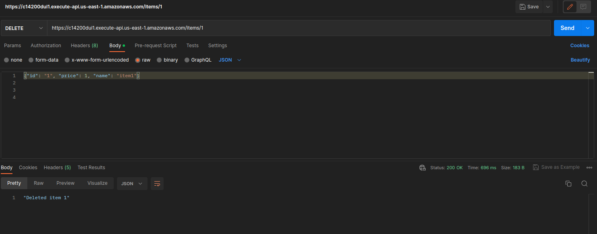

# Example of API on AWS  with Lambda and DynamoDB

When you invoke your HTTP API, API Gateway routes the request to your Lambda function. The Lambda function interacts with DynamoDB, and returns a response to API Gateway. API Gateway then returns a response to you.

\
\


## Initial Setup

You should also have an AWS IAM user configured with the necessary  IAM permissions to access API Gateway and Lambda resources in your AWS Account. 
This IAM user would be used to authenticate the Terraform  to manage AWS services. When setting up a Terraform project, it’s essential to structure the code in a way that will be easy to maintain and understand. Start by creating a file containing all the provider and resource configurations. 
Next, create separate files for each API gateway resources, openapi specification, etc. It helps to keep the code organized and makes it easy to find the information needed.


## Terraform API Gateway 

1. Create providers.tf, variables.tf and outputs.tf in directory root

2. Create lambda function

3. Create an HTTP API

4. Create routes

5. Create integration

6. Attach your integration to routes

7. Test API

8. Clean ip

 

## Structure

```
.
├── api.tf
├── dynamodb.tf
├── lambda.tf
├── main.tf
├── modules
│   └── api_gateway
│       ├── outputs.tf
│       ├── rest_api.tf
│       └── variables.tf
├── outputs.tf
├── providers.tf
├── terraform.tfstate
├── terraform.tfstate.backup
├── testing.png
└── variables.tf

```
## Deploy 

```
terraform init 
```

```
terraform plan
```
```
terraform apply -auto-approve 
```

### Testing


GET empty


PUT one item


GET item 


DELETE item 




```
terraform destroy
```

### Github Actions


